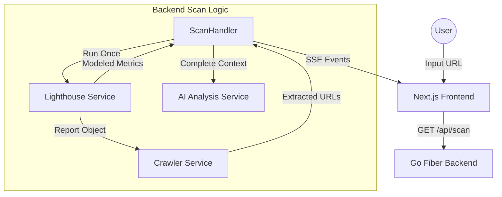

# Integration Plan: Lighthouse Insights (Refined)

This plan outlines the steps to integrate deep quality and experience metrics from Lighthouse into the SiteProbe.io platform, with a focus on performance optimization and specialized insights like SPA visibility.

## 1. Backend: Data Modeling

Update [`backend/models/result.go`](backend/models/result.go) to include new data structures:

- `PerformanceMetrics`: LCP, CLS, TBT, FCP, SpeedIndex values and scores.
- `SEOCompliance`: Canonical check, robots.txt presence, and "SPA Visibility" (Ratio of Text in raw HTML vs Rendered DOM).
- `SecurityRisk`: Third-party script sources, counts, and critical security headers (CSP, HSTS).
- `AccessibilityInfo`: Overall score and top 3-5 failing audits with descriptions.

## 2. Backend: Lighthouse Service (Optimized)

Create [`backend/services/lighthouse.go`](backend/services/lighthouse.go) to handle:

- **Single Run**: Execute Lighthouse ONCE with categories: `performance`, `seo`, `accessibility`, `best-practices`.
- **Caching**: Store the resulting JSON in-memory (per request) so other services (like Crawler) can access it.
- **Advanced Parsing**: Extract trace data for "JS Long Tasks" and "LCP element" diagnosis.
- **SPA Visibility calculation**: Compare raw response from `httpx` (or internal fetch) with the rendered DOM from Lighthouse.

## 3. Backend: Service Refactoring

Refactor [`backend/services/crawler.go`](backend/services/crawler.go):

- **Dependency Injection**: The `ExtractPageUrls` should now accept a pointer to the Lighthouse report if available, falling back to goquery ONLY if Lighthouse fails or is disabled.
- **Resource Extraction**: Prioritize Lighthouse's `network-requests` list for accurate asset discovery.

## 4. Backend: API & Orchestration (SSE Streaming)

Update [`backend/routes/scan.go`](backend/routes/scan.go):

- **Parallelism**: Run SSL/Domain info in parallel with the Lighthouse run.
- **Stream Order**: Emit `performance-info`, `seo-info`, etc., as soon as the Lighthouse JSON is parsed and modeled.
- **AI Integration**: Update `GenerateAIAnalysis` prompt (in `ai.go`) to interpret these new specialized metrics.

## 5. Frontend: UI Components & UX

- Update [`frontend/types/scan.ts`](frontend/types/scan.ts) with the expanded response interfaces.
- Create new components in [`frontend/components/`](frontend/components/):
    - `PerformanceCard.tsx`: Radial gauges and a "Diagnostic" sub-section for LCP/TBT.
    - `SEOComplianceCard.tsx`: Checklist with "SPA Visibility" indicator.
    - `SecurityPanel.tsx`: Grouped by "Headers" and "Third-party Scripts".
    - `AccessibilityCard.tsx`: Score and collapsible list of "Improvements Needed".
- Update `UrlInput.tsx` or scan page to allow selecting these new advanced options.
